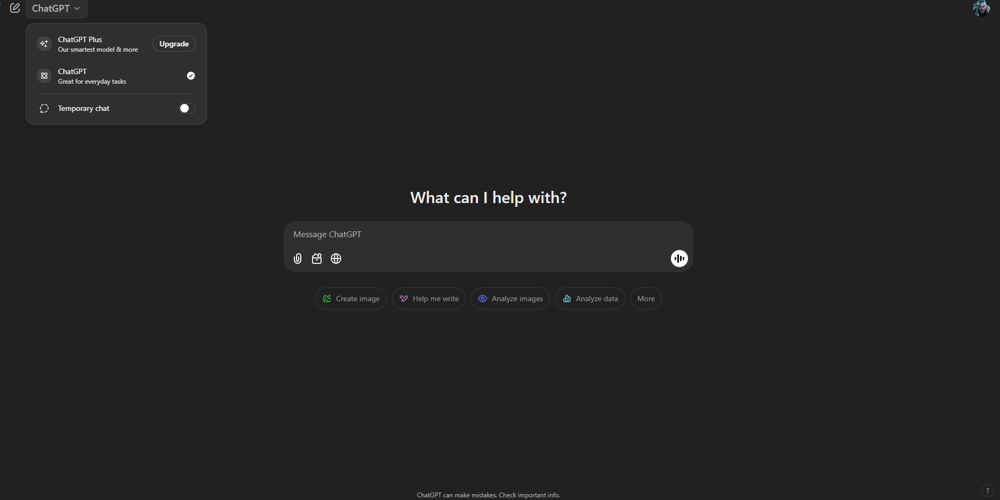

 
# Git Project - README

## Project Overview
This project is created to demonstrate the usage of Git and GitHub workflows using Visual Studio Code (VS Code). It includes essential Git commands, distinctions between local and remote workflows, encountered difficulties, and reflections on using AI for assistance.

---

## Table of Contents
- [Setting Up Git in VS Code](#setting-up-git-in-vs-code)
- [Git Commands Used](#git-commands-used)
- [Local Git Workflow vs. GitHub Workflow](#local-git-workflow-vs-github-workflow)
- [Challenges Encountered](#challenges-encountered)
- [Commit Decisions](#commit-decisions)
- [AI Assistance and Benefits](#ai-assistance-and-benefits)

---

## Setting Up Git in VS Code
1. **Install Git** if not already installed: [Download Git](https://git-scm.com/downloads)
2. **Open VS Code** and install the **GitLens** extension for enhanced Git integration.
3. **Enable Git in VS Code:**
   - Open the **Source Control** tab (Ctrl + Shift + G).
   - Click **Initialize Repository** if not already done.
4. **Connect to GitHub:**
   - Click **Publish to GitHub** from the Source Control panel.
   - Authenticate with your GitHub account.
   - Select the repository visibility (Public/Private).
5. **Start tracking changes and committing through VS Code.**

---

## Git Commands Used
Below is a table describing the Git commands used in this project:

| Command | Description |
|---------|-------------|
| `git init` | Initializes a new Git repository |
| `git add .` | Stages all changes for commit |
| `git commit -m "message"` | Commits changes with a message |
| `git branch -M main` | Renames the branch to `main` |
| `git remote add origin <URL>` | Adds a remote repository |
| `git push -u origin main` | Pushes local changes to GitHub |

---

## Local Git Workflow vs. GitHub Workflow

### **Local Git Workflow:**
1. Create and modify files in **VS Code**.
2. Use `git add .` to stage changes.
3. Use `git commit -m "message"` to save changes locally.
4. The changes exist only on the local repository until pushed to GitHub.

### **GitHub Workflow:**
1. Connect a local repository to a GitHub repository using VS Code.
2. Use `git push` to send local commits to the GitHub repository.
3. Use `git pull` to fetch the latest updates from the remote repository.
4. Collaborate with others using pull requests and merging.

---

## Challenges Encountered
During this process, the following challenges were encountered:
- **Error:** `src refspec main does not match any` → Resolved by creating the `main` branch first using `git branch -M main`.
- **Authentication Issues:** Encountered issues while pushing to GitHub due to missing authentication setup.
- **Understanding Remote vs Local Workflow:** Initially, there was confusion about when to commit locally and when to push.
- **VS Code Git Integration:** Sometimes, the Source Control tab did not reflect changes immediately.

---

## Commit Decisions
Commits were made at key points:
- After initializing the repository in VS Code.
- After creating the basic project structure.
- After implementing fixes for encountered errors.
- Before pushing to GitHub to ensure a clean history.

---

## AI Assistance and Benefits
AI was used to troubleshoot Git errors, understand workflows, and optimize project documentation. 

**Question Asked:**
- How to resolve Git push errors in VS Code?
- What is the best practice for committing changes in VS Code?

**Platform Used:**
- ChatGPT

**Key Learnings:**
- The importance of branch management in Git.
- Troubleshooting authentication issues in VS Code.
- Best practices for structuring a README file.

---

## Image and Example
Below is an example image illustrating the Git workflow:

---

## How to Push from VS Code to GitHub
1. Open the **Source Control** tab in VS Code (Ctrl + Shift + G).
2. Stage changes by clicking the **+** button next to each file or use `git add .`.
3. Write a commit message and click the **✔ Commit** button or use `git commit -m "message"`.
4. Click **Sync Changes** or use `git push origin main` to upload your changes to GitHub.
5. Verify the changes on your GitHub repository.

🚀 **Your project is now successfully managed with Git and GitHub using VS Code!**

